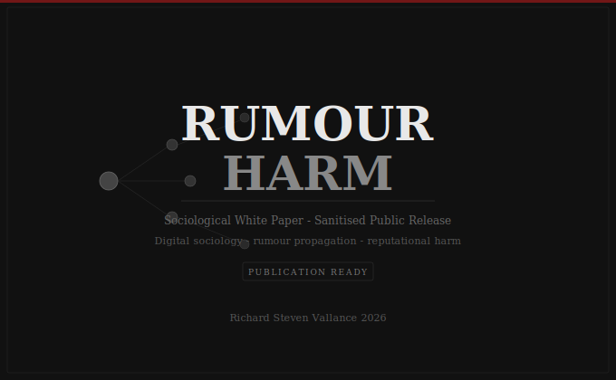

# Rumour Harm

## Sociological White Paper — Sanitised Public Release

**Author:** Richard Steven Vallance
**Parent Ecosystem:** [richard-vallance-archive](https://github.com/richievallance/richard-vallance-archive)
**Constitutional Classification:** Sociological White Paper
**Publication Status:** 🟢 Publication Ready

---

## Purpose

Sanitised public white paper on rumour propagation, reputational harm, and digital sociology. Documentary style. Constitutionally separate from Leonardo / Da Valenca and USC research.

---

## Repository Contents

- Full white paper (Markdown edition)
- CITATION.cff
- metadata.json / zenodo.json
- SHA-256 hashes

---

## Legal Notice

© 2026 Richard Steven Vallance. All Intellectual Property and Copyright Reserved.
